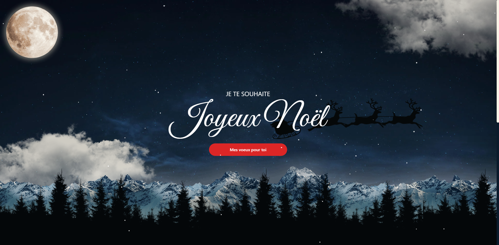

# Christmas Wishes App 🎄

Une application web festive pour partager l'esprit de Noël avec des animations et des vœux personnalisés.



## ✨ Fonctionnalités

- Design responsive adapté à tous les écrans
- Animations parallaxes fluides
- Animation du Père Noël traversant le ciel
- Effet de neige tombante
- Navigation fluide entre les sections
- Typographie festive avec Google Font (Great Vibes)

## 🛠 Technologies Utilisées

- React + TypeScript
- Tailwind CSS pour le styling
- Vite comme bundler
- Animations CSS personnalisées

## 🚀 Installation

1. Clonez le repository

```bash
git clone https://github.com/Rodagency10/merry-christmas.git
```
2. Installez les dépendances

```bash
npm install
```

3. Lancez l'application en mode développement

```bash
npm run dev
```


## 🌟 Crédits

- Design inspiré de https://dribbble.com/shots/17022162-Christmas-Gift-Card-Landing-Page-For-WordPress
- Police "Great Vibes" de Google Fonts

## 📄 Licence

MIT License - Libre d'utilisation et de modification